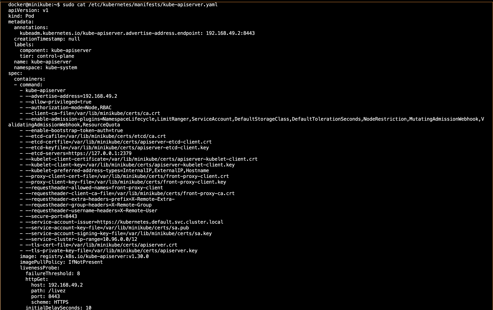
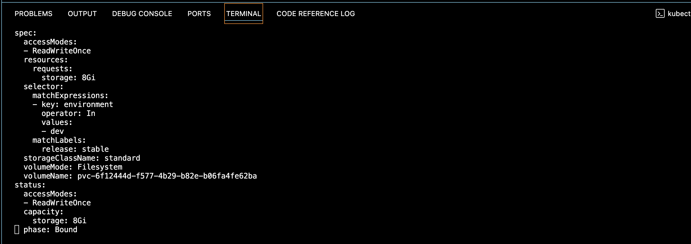
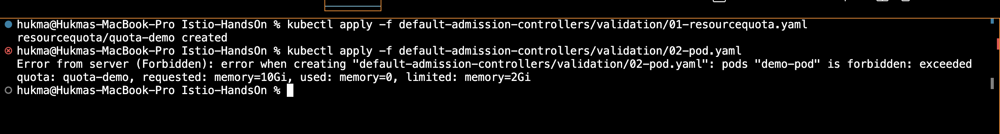
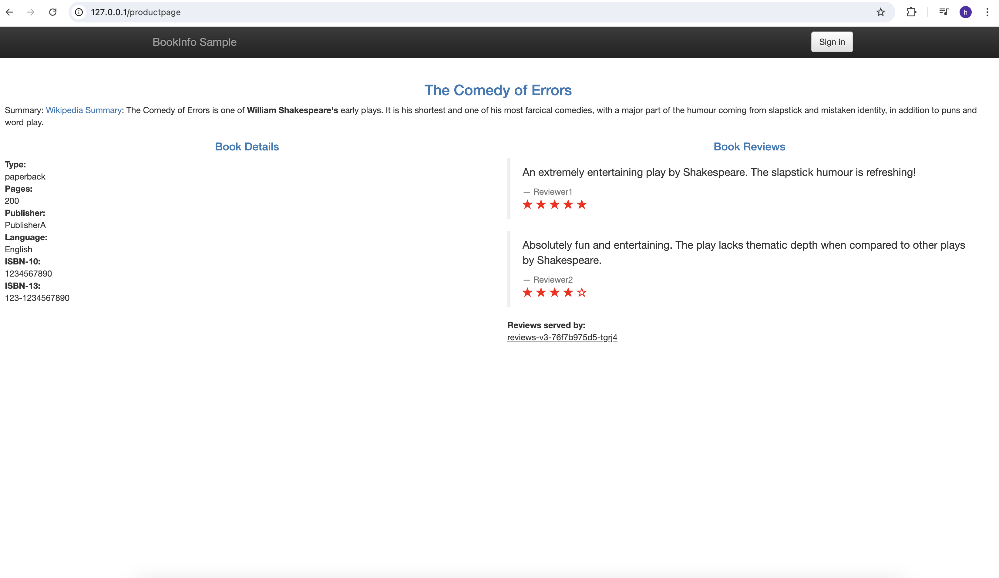
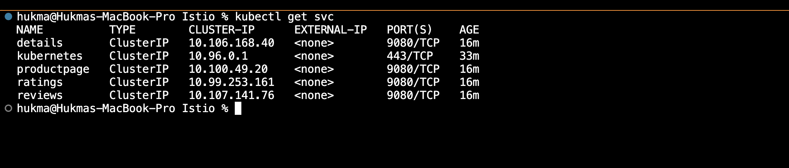
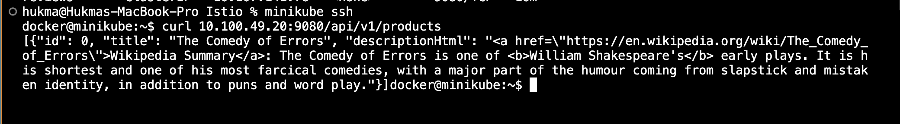
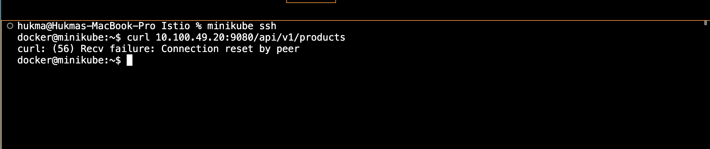
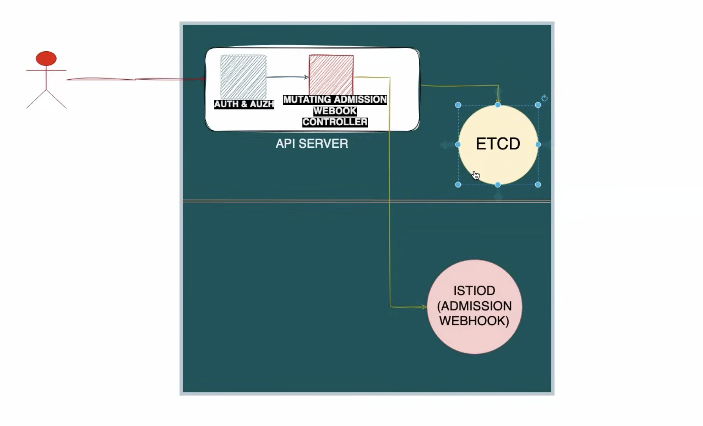
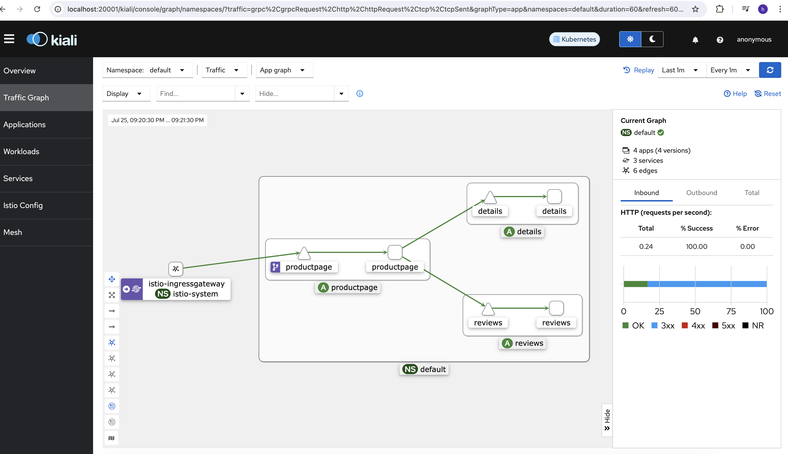

# Istio-HandsOn

What is service mesh?
= Service Mesh helps with traffic management in kubernetes( East-West traffic )

E-W traffic = service to service traffic
N-S traffic = Traffic coming from outsite (Ingress and Egress)

Why we need service mesh?

1. Istio adds mutual TLS for secure service to service communication.
2. Canary deployment
3. Istio comes with Kiali which is observability tool.

How does service mesh works?
= It adds a sidecar container to the pod (Envoy proxy) and traffic flows through this side car container. It intercept the traffic. These side car containers enhances or extend the functionality of the main container such as handling network, logging, monitoring tasks.

How does istio adds sidecar container?
= Istio uses a dynamic admission controller which is called by the API server using webhook and admission controller intercept and modify and validate the api calls before it is stored in etcd.

There are 30+ admission controllers available by default in k8s.
To check the default admission controllers -

`minikube ssh` and `sudo cat /etc/kubernetes/manifests/kube-apiserver.yaml`

We can see a following admission controllers are present by default - NamespaceLifecycle,LimitRanger,ServiceAccount,DefaultStorageClass,DefaultTolerationSeconds,NodeRestriction,MutatingAdmissionWebhook,ValidatingAdmissionWebhook,ResourceQuota

These admission controllers does two thing - Mutation and Validation

To verify mutation, we can create a persistent volume claim and we will see that a storage class is attached to the PVC automatically by this controller before the resource manifest is stored in etcd.

Create a pvc using following command
`kubectl apply -f default-admission-controllers/mutation/01-mutation-storage-class.yaml`

Now to check the mutation run following command
`kubecl edit pvc myclaim`

Notice that a storageClassName is added-

To verify Validation, We will create a namespace with RAM of 2GB and then we will try to allocate a 10GB of RAM to a pod in this namespace and the admission controller will validate and fail the pod creation.

Run below commands -

`kubectl apply -f default-admission-controllers/validation/01-resourcequota.yaml`
``

Istio is a external controller so how does API server connects to the Istio controller webhook?

## Istio installation

Download `curl -L https://istio.io/downloadIstio | sh -`
Export path `export PATH=$PWD/bin:$PATH`

The bin folder contains istioctl command line tool.

Now to install istio demo profile, run following command

`istioctl install --set profile=demo -y`

Add a namespace label to instruct Istio to automatically inject Envoy sidecar proxies
`kubectl label namespace default istio-injection=enabled`

deploy the sample application
`kubectl apply -f samples/bookinfo/platform/kube/bookinfo.yaml`

Expose the application using Istio gateway
`kubectl apply -f samples/bookinfo/networking/bookinfo-gateway.yaml`

and start minikube tunnel
`minikube tunnel`

Now we can access the product page at `http://127.0.0.1/productpage`

## mTLS
By default Istio runs in permissive mode in which the services are accessible with and without TLS mode.

to verify, login into minikube master node and curl the productpage microservice.

`kubectl get svc`

`minikube ssh`
`curl 10.100.49.20:9080/api/v1/products`

Now, To enable strict mode we need to run `kubectl apply -f mTLS/tls-mode.yaml`

Now the services are not accessible without TLS.

## Canary Deployment

to route all requests to v1 version 
`kubectl apply -f istio-1.22.3/samples/bookinfo/networking/virtual-service-all-v1.yaml`

run to verify `kubectl get virtualservices -o yaml`

Now all the requests will go to V1.

Now let's apply `kubectl apply -f traffic-management/traffic-shifting/02-traffic-shifting.yaml`

Now 50% traffic goes to V1 and 50% to v2 of reviews microservice.

## Dynamic admission controller

The default admission controller Mutating admission webhook controller calls the istiod admission controller after API server authorizes the API request. To do this we need to create a custom resource which define these rules. The Istiod admission webhook controller then mutate or validate the request.
The request then sent back to API server and then to etcd.

## Kiali 

Istio comes with Kiali obserability tool.

Install using following command
`kubectl apply -f samples/addons`
`kubectl rollout status deployment/kiali -n istio-system`
`istioctl dashboard kiali`

# Definitions

### Admission Controllers

Admission controllers in Kubernetes enforce policies on objects during their creation or modification. They intercept requests to the Kubernetes API server before objects are persisted and can modify or deny requests based on predefined rules.

### Sidecar Containers

In Kubernetes, sidecar containers are auxiliary containers that run alongside the main application container within the same pod. They enhance or extend the functionality of the main container, such as handling networking, logging, or monitoring tasks.

### What is a Service Mesh?

A service mesh is a dedicated infrastructure layer for handling service-to-service communication within a distributed application. It provides features like traffic management, observability, security, and resilience without requiring changes to the application code.

### Why do you need a Service Mesh?

Service meshes address challenges in managing microservices architectures by offering centralized control over communication, improving reliability through features like circuit breaking and retries, enhancing security with mutual TLS, and providing visibility into service interactions.

### Traffic Management

Traffic management in a service mesh involves controlling the flow of requests between services. This includes features such as load balancing, routing, traffic shaping, and fault tolerance mechanisms like retries and circuit breaking.

### Virtual Services

Virtual services in Istio define how incoming requests to a service should be routed to different versions or subsets of that service. They enable sophisticated traffic management strategies like A/B testing and canary deployments.

### Destination Rules

Destination rules in Istio configure the traffic policies applied to the traffic destined for a particular service version or subset. They define things like load balancing algorithms, circuit breaking settings, and TLS settings for communication between services.

### Circuit Breaking

Circuit breaking is a pattern used to prevent cascading failures in distributed systems. In Istio, it involves setting thresholds for error rates or latency, and if these thresholds are exceeded, requests to a service are automatically stopped, preventing further damage.

### mTLS (Mutual TLS)

Mutual TLS in Istio ensures secure communication between services by requiring both the client and the server to present a valid TLS certificate. It encrypts traffic and provides authentication, preventing unauthorized access or eavesdropping.

### Gateways

Gateways in Istio allow external traffic to enter the service mesh. They act as ingress and egress points for traffic, enabling communication between services inside the mesh and external clients or services outside the mesh.

### Observability

Observability in a service mesh refers to the ability to monitor, trace, and analyze the behavior and performance of services. It includes features like distributed tracing, metrics collection, and logging to provide insights into the health and operation of the system.

### Service Mesh vs Ingress

A service mesh operates at the layer of service-to-service communication within a cluster, providing features like traffic management, security, and observability. In contrast, an ingress controller manages external access to services within the cluster, typically handling tasks like load balancing, SSL termination, and routing based on HTTP/HTTPS requests.

